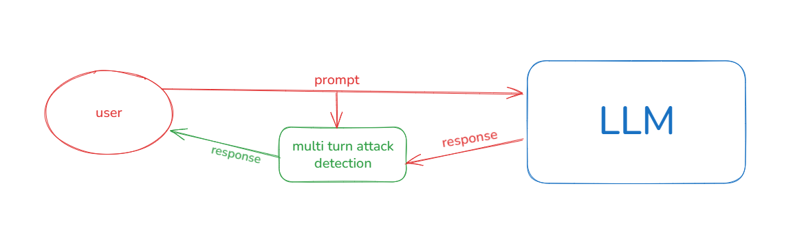

# Temporal Context Awareness (TCA) 

## 1. Project Overview
This repository is inspired by the paper:

**Temporal Context Awareness: A Defense Framework Against Multi-turn Manipulation Attacks on Large Language Models**  

(arXiv:2503.15560v1, Kulkarni and Namer, 2025)

Paper link: https://arxiv.org/abs/2503.15560v1  
PDF: https://arxiv.org/pdf/2503.15560v1

The goal is to detect risky multi-turn conversations by modeling how intent and behavior evolve across turns, instead of relying on single-turn safety checks.

This implementation focuses on:
- turn-level feature extraction,
- progressive risk scoring across conversation history,
- final binary classification of risky vs benign behavior.

## 2. Dataset Basis

Hugging Face dataset: https://huggingface.co/datasets/LLM-LAT/benign-dataset

## 3. Repository Structure (Important Files)
- `pipeline.ipynb`: main end-to-end notebook (data prep, features, risk recomputation, modeling, tuning).
- `src/feature_extraction.py`: turn-level and temporal features:
  - `toxicity_score`
  - `threat_score`
  - `topic_shift_score`
  - `cumulative_drift`
  - `drift_acceleration`
  - `post_refusal`
- `src/risk_calculator.py`: weighted risk functions:
  - interaction risk
  - pattern risk
  - progressive risk (depends on previous turn risk)
- `src/refusal_model.py`: refusal classifier training/loading utilities (MLflow + Optuna + XGBoost).
- `data/`: source and cleaned datasets for training.
- `mlruns/`: MLflow experiment tracking artifacts.

## 4. Mapping to the Paper Concepts
The paper emphasizes temporal, context-aware defense. This code maps to that idea as follows:

1. Dynamic context embedding analysis:
- Implemented using sentence embeddings and drift features in `FeatureExtractor`.

2. Cross-turn consistency checks:
- Captured through features that compare current turn context to previous context (topic shift and drift progression).

3. Progressive risk scoring:
- Implemented in `RiskCalculator.calculate_progressive_risk(...)` where current risk depends on previous risk plus current interaction/pattern signals.

4. Final safety decision:
- A downstream classifier (Logistic Regression/XGBoost/SVM in notebook experiments) predicts attack/risk labels.
